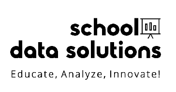

  

At School Data Solutions, we enhance curriculum development through data-driven insights, ensuring alignment with educational standards and optimizing learning outcomes for all students.

- Educational Technology Solutions: Highlighting your use of cutting-edge technology to create systems that streamline operations, enhance data management, and improve the overall educational experience.

- Operational Efficiency Expertise: Focusing on how your solutions increase the efficiency of school operations, such as scheduling, planning, and administrative tasks, thus allowing educators to focus more on teaching and less on bureaucratic processes.

- Strategic Educational Consulting: Emphasizing your role in providing expert insights that help schools make data-informed decisions to tackle their unique challenges and improve both student and institutional outcomes.
